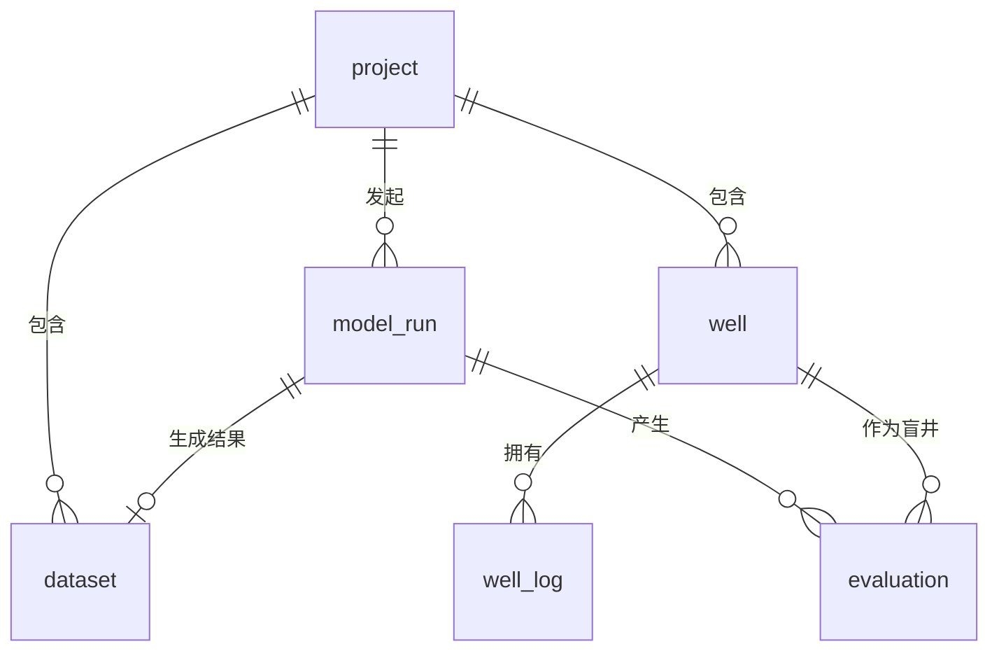
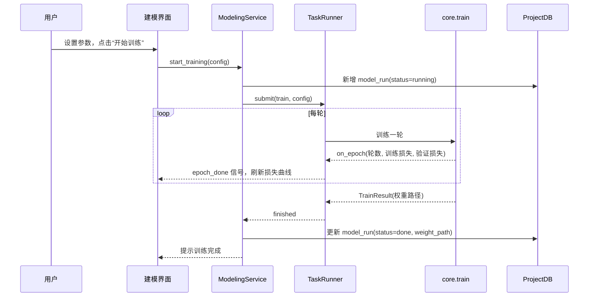
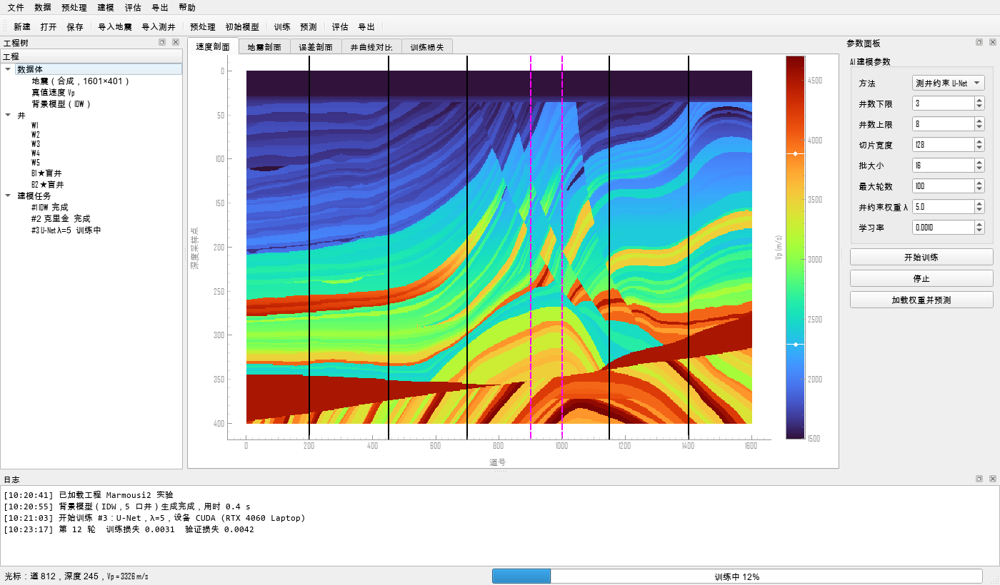

# 软件设计说明书

| 项目 | 内容 |
|---|---|
| 软件名称 | 井震联合速度场建模系统（velbuilder） |
| 版本 | v0.1（草稿） |
| 编写 | 刘星 |
| 日期 | 2026-09-29 |
| 依据 | 《软件需求规格说明书》（docs/01）、《算法方案》（docs/03） |

# 第一部分 概要设计

## 1 设计原则

- **分层单向依赖**：表示层 → 业务逻辑层 → 算法层 / 数据访问层。算法层只依赖 numpy、scipy、torch，不导入 Qt，能单独测试和命令行调用。
- **数据以数组为中心**：各层之间传递 numpy 数组和轻量数据类（dataclass），不传递文件句柄或 Qt 对象。
- **统一约定**：二维数组一律按（道, 深度）排列；速度单位一律为 m/s；深度单位为 m。
- **可扩展注册**：插值方法和网络模型用注册表管理，新增方法只需注册，不改调用方。

## 2 总体架构

```
┌───────────────────────── 表示层 gui/ ─────────────────────────┐
│ MainWindow  ProjectTree  PlotTabs  ParamPanels  LogDock       │
└───────────────┬───────────────────────────────────────────────┘
                │ 调用服务、接收 Qt 信号
┌───────────────▼──────────── 业务逻辑层 services/ ─────────────┐
│ ProjectService  PreprocessService  ModelingService            │
│ EvaluationService  ExportService  TaskRunner(QThread 封装)     │
└───────┬─────────────────────────────────────────┬─────────────┘
        │                                         │
┌───────▼──────── 算法层 core/ ────────┐ ┌────────▼──── 数据访问层 io/ ────┐
│ welllog  interp  dataset  unet       │ │ seismic  well  marmousi         │
│ train  predict  metrics  synthetic   │ │ project_db  export              │
└──────────────────────────────────────┘ └─────────────────────────────────┘
```

业务逻辑层同时调用算法层和数据访问层；算法层与数据访问层互不依赖。

## 3 模块划分与需求对应

| 功能 | 业务服务 | 算法层模块 | 数据访问层模块 |
|---|---|---|---|
| F1 数据管理 | ProjectService | — | seismic、well、marmousi、project_db |
| F2 预处理与标定 | PreprocessService | welllog | well |
| F3 初始模型 | ModelingService | interp | — |
| F4 AI 建模 | ModelingService | dataset、unet、train、predict | project_db |
| F5 可视化与评估 | EvaluationService | metrics | project_db |
| F6 导出与报告 | ExportService | — | export、project_db |

## 4 运行时结构

- **主线程**：Qt 事件循环与界面绘制。
- **工作线程**：`TaskRunner` 继承 `QThread`，执行训练、预测、插值、留一法检验等耗时任务，通过信号回传进度（`progress(int)`）、日志（`log(str)`）、训练损失（`epoch_done(int, float, float)`）和结果（`finished(object)`）。每次只运行一个耗时任务，任务可请求中止，算法层在每个批次或每层插值后检查中止标志。
- **日志**：Python `logging`，同时输出到界面日志栏和 `<工程目录>/logs/velbuilder.log`。

## 5 工程目录结构

```
<工程名>/
  project.db            SQLite 工程库（只存元数据与路径）
  datasets/             导入或生成的数据体（NPY，float32）
  wells/                规范化后的测井曲线（CSV）
  models/<run_id>/      权重、检查点、训练日志、配置
  exports/              导出的数据、图件与报告
  logs/
```

导入时原始文件复制并转换为 NPY 存入 `datasets/`，之后不再访问原始文件，满足“原始数据只读”的要求。

# 第二部分 详细设计

## 6 数据库设计

### 6.1 E-R 图



### 6.2 建表语句

```sql
CREATE TABLE project (
    project_id   INTEGER PRIMARY KEY AUTOINCREMENT,
    name         TEXT NOT NULL,
    root_path    TEXT NOT NULL,
    description  TEXT,
    created_at   TEXT NOT NULL DEFAULT (datetime('now', 'localtime'))
);

CREATE TABLE dataset (
    dataset_id   INTEGER PRIMARY KEY AUTOINCREMENT,
    project_id   INTEGER NOT NULL REFERENCES project(project_id) ON DELETE CASCADE,
    name         TEXT NOT NULL,
    type         TEXT NOT NULL CHECK (type IN ('seismic', 'velocity', 'result', 'background')),
    file_path    TEXT NOT NULL,          -- 相对工程目录
    format       TEXT NOT NULL,          -- 原始格式：segy / npy / bin
    n_traces     INTEGER NOT NULL,
    n_samples    INTEGER NOT NULL,
    dx           REAL NOT NULL,
    dz           REAL NOT NULL,
    unit         TEXT,
    vmin         REAL,
    vmax         REAL,
    created_at   TEXT NOT NULL DEFAULT (datetime('now', 'localtime'))
);

CREATE TABLE well (
    well_id      INTEGER PRIMARY KEY AUTOINCREMENT,
    project_id   INTEGER NOT NULL REFERENCES project(project_id) ON DELETE CASCADE,
    name         TEXT NOT NULL,
    x            REAL,
    y            REAL,
    trace_index  INTEGER,                -- 投影到剖面的道号
    kb           REAL,                   -- 补心海拔
    is_blind     INTEGER NOT NULL DEFAULT 0,
    UNIQUE (project_id, name)
);

CREATE TABLE well_log (
    log_id       INTEGER PRIMARY KEY AUTOINCREMENT,
    well_id      INTEGER NOT NULL REFERENCES well(well_id) ON DELETE CASCADE,
    curve_name   TEXT NOT NULL,          -- DT / VP / VP_BLOCKED 等
    unit         TEXT,
    file_path    TEXT NOT NULL,
    depth_start  REAL NOT NULL,
    depth_end    REAL NOT NULL,
    step         REAL NOT NULL,
    source_log_id INTEGER REFERENCES well_log(log_id),  -- 由哪条曲线处理得到
    UNIQUE (well_id, curve_name)
);

CREATE TABLE model_run (
    run_id              INTEGER PRIMARY KEY AUTOINCREMENT,
    project_id          INTEGER NOT NULL REFERENCES project(project_id) ON DELETE CASCADE,
    method              TEXT NOT NULL,   -- idw / kriging / rbf / unet
    params_json         TEXT NOT NULL,
    weight_path         TEXT,            -- 仅 unet
    status              TEXT NOT NULL CHECK (status IN ('pending', 'running', 'done', 'failed', 'cancelled')),
    result_dataset_id   INTEGER REFERENCES dataset(dataset_id) ON DELETE SET NULL,
    started_at          TEXT,
    finished_at         TEXT,
    message             TEXT             -- 失败原因
);

CREATE TABLE evaluation (
    eval_id        INTEGER PRIMARY KEY AUTOINCREMENT,
    run_id         INTEGER NOT NULL REFERENCES model_run(run_id) ON DELETE CASCADE,
    scope          TEXT NOT NULL CHECK (scope IN ('field', 'blind', 'loo')),
    metric         TEXT NOT NULL CHECK (metric IN ('RMSE', 'MAE', 'MAPE', 'SSIM', 'R2')),
    value          REAL NOT NULL,
    blind_well_id  INTEGER REFERENCES well(well_id) ON DELETE SET NULL
);

CREATE INDEX idx_dataset_project ON dataset(project_id);
CREATE INDEX idx_well_project    ON well(project_id);
CREATE INDEX idx_run_project     ON model_run(project_id);
CREATE INDEX idx_eval_run        ON evaluation(run_id);
```

说明：相比开题书中的表结构，补充了 `dataset.name/unit/vmin/vmax`、`well.is_blind`、`well_log.source_log_id`、`model_run.message` 和 `evaluation.scope`，用于记录盲井、处理溯源和失败原因。连接时执行 `PRAGMA foreign_keys = ON`。

## 7 核心数据结构

```python
@dataclass
class Grid:
    n_traces: int
    n_samples: int
    dx: float          # m
    dz: float          # m
    x0: float = 0.0    # 第 0 道横坐标

@dataclass
class Section:         # 地震或速度剖面
    data: np.ndarray   # (n_traces, n_samples) float32
    grid: Grid
    kind: str          # seismic / velocity / result / background
    unit: str = ""

@dataclass
class WellLog:
    name: str
    depth: np.ndarray            # m，递增
    curves: dict[str, np.ndarray]
    units: dict[str, str]
    x: float | None = None
    y: float | None = None

@dataclass
class WellPoint:                 # 已投影到剖面的井
    name: str
    trace_index: int
    vp: np.ndarray               # (n_samples,) m/s，已粗化并重采样到剖面深度网格
```

## 8 模块接口

### 8.1 数据访问层 `io/`

| 模块 | 接口 | 说明 |
|---|---|---|
| seismic | `read_segy(path) -> Section` | segyio 读取，道头取道间距与采样间隔 |
| | `write_segy(section, path)` | |
| | `read_array(path, shape=None, dtype='float32') -> np.ndarray` | NPY 或 BIN，BIN 必须给 shape |
| | `validate_section(data, kind) -> list[str]` | 返回问题列表，空表示通过 |
| well | `read_las(path) -> WellLog` | lasio |
| | `read_csv_logs(path, depth_col, curve_cols, well_col=None) -> list[WellLog]` | 支持 Taranaki 多井单表 |
| | `read_coords(path) -> dict[str, tuple[float, float]]` | |
| marmousi | `load_velocity(path) -> np.ndarray` | 已实现 |
| | `load_seismic_npy(path) -> np.ndarray` | 已实现 |
| project_db | `class ProjectDB(path)` | 封装 sqlite3 连接 |
| | `add_dataset / get_dataset / list_datasets / delete_dataset` | 其他五张表同样提供增删改查 |
| export | `export_section(section, path, fmt)` | fmt: segy / npy / bin / csv |
| | `export_figure(fig, path)` | PNG / PDF |

### 8.2 算法层 `core/`

| 模块 | 接口 | 说明 |
|---|---|---|
| welllog | `clean(log, curve, valid_range, spike_window=11, spike_k=3.0, max_gap=5.0) -> WellLog` | 空值、尖峰、短缺失段 |
| | `dt_to_vp(dt) -> np.ndarray` | Vp = 304800 / DT |
| | `block(depth, vp, window, method='mean'/'backus') -> np.ndarray` | 粗化 |
| | `resample_to_grid(depth, vp, grid) -> np.ndarray` | |
| | `project_well(x, y, line_coords) -> int` | 井位投影到最近道 |
| interp | `INTERPOLATORS: dict[str, Callable]` | 注册表 |
| | `idw(wells, grid, power=2) -> np.ndarray` | wells: list[WellPoint] |
| | `kriging(wells, grid, variogram='spherical') -> np.ndarray` | |
| | `rbf(wells, grid, kernel='thin_plate_spline') -> np.ndarray` | |
| | `smooth(v, sigma) -> np.ndarray` | |
| synthetic | `synthesize_depth_seismic(vp, dz, freq, ...)` | 已实现 |
| dataset | `class PatchDataset(torch.utils.data.Dataset)` | 在线生成切片样本，见算法方案第 3、4 节 |
| | `sample_wells(n_traces, allowed, n_range, min_gap, rng) -> list[int]` | |
| | `build_inputs(seis, background, well_idx) -> np.ndarray` | 三通道 |
| unet | `class UNet(nn.Module)` | `in_ch=3, base=32, depth=4, residual=True` |
| | `MODELS: dict[str, type]` | 注册表 |
| train | `well_constrained_loss(pred, target, mask, lam) -> Tensor` | |
| | `train(config, on_epoch=None, should_stop=None) -> TrainResult` | 回调供业务层发信号 |
| predict | `predict_section(model, seis, background, well_idx, window=128, stride=64) -> np.ndarray` | 滑窗 + 余弦加权 |
| metrics | `rmse / mae / mape / ssim / r2(pred, true, mask=None) -> float` | |
| | `evaluate(pred, true, well_idx=None) -> dict[str, float]` | |
| | `leave_one_out(method, wells, grid, true) -> dict[str, float]` | |

### 8.3 业务逻辑层 `services/`

| 服务 | 主要方法 |
|---|---|
| ProjectService | `new_project / open_project / import_section / import_wells / list_items` |
| PreprocessService | `preprocess_well(well_id, params) / project_wells(line_id)` |
| ModelingService | `build_background(method, params) / start_training(config) / predict(run_id, target)` |
| EvaluationService | `evaluate(run_id, truth_id) / leave_one_out(method, params) / compare(run_ids)` |
| ExportService | `export_dataset(id, fmt, path) / export_report(run_ids, path)` |
| TaskRunner | `submit(fn, *args) / cancel()`；信号 `progress / log / epoch_done / finished / failed` |

## 9 关键流程

### 9.1 训练与预测时序



### 9.2 导入校验规则

| 检查项 | 规则 | 提示 |
|---|---|---|
| 可解析 | 读取不抛异常 | “无法解析文件：<原因>” |
| 维度 | 二维；BIN 大小等于给定形状 | “数据大小与形状不符” |
| 数值 | 无 NaN/Inf；速度在 300～8000 m/s | “速度超出合理范围，请检查单位（是否为 km/s）” |
| 网格匹配 | 同一工程内地震与速度道数、采样数、间距一致 | “与已有剖面网格不一致” |
| 测井 | 深度递增；存在 DT 或 VP 曲线 | “未找到声波时差或速度曲线” |

## 10 界面设计

### 10.1 主窗口布局

```
┌──────────────────────────────────────────────────────────────────────┐
│ 文件  数据  预处理  建模  评估  导出  帮助                            │
│ [新建][打开][保存] | [导入地震][导入测井] | [训练][预测] | [评估][导出] │
├──────────────┬───────────────────────────────────────┬───────────────┤
│ 工程树        │  [速度剖面][地震剖面][误差][井曲线][损失] │ 参数面板       │
│ ▾ 数据体      │                                       │（随当前步骤切换）│
│   · 地震       │                                       │               │
│   · 真值速度   │          剖面绘图区（pyqtgraph）        │ 方法：[U-Net ▾]│
│ ▾ 井          │          色标 / 缩放 / 光标读值          │ λ：  [5     ] │
│   · W1 ★盲井   │                                       │ 学习率：[1e-3] │
│ ▾ 建模任务    │                                       │ [开始] [停止]  │
│   · #3 U-Net  │                                       │               │
├──────────────┴───────────────────────────────────────┴───────────────┤
│ 日志：[10:21:03] 第 12 轮 训练损失 0.0031 验证损失 0.0042   ████░░ 60% │
└──────────────────────────────────────────────────────────────────────┘
```

主窗口静态原型（`scripts/ui_prototype.py` 生成，黑色实线为建模井，紫色虚线为盲井）：



### 10.2 各步骤界面

| 界面 | 形式 | 主要控件 |
|---|---|---|
| 导入 | 对话框 | 文件选择；格式、形状、dx/dz、单位；预览缩略图；校验结果列表 |
| 预处理 | 参数面板 + 绘图页 | 井选择；清洗、粗化参数；原始/清洗/粗化三条曲线叠合显示 |
| 初始模型 | 参数面板 | 井勾选；插值方法与参数；平滑 σ；生成后自动显示 |
| 建模 | 参数面板 + 损失页 | 训练数据选择；井数范围、切片大小、λ、学习率、轮数；实时损失曲线；预测按钮 |
| 评估 | 参数面板 + 对比页 | 选择结果与真值；指标表（多方法并列）；误差剖面；井曲线对比；留一法按钮 |
| 导出 | 对话框 | 数据体、格式、路径；图件导出；报告生成 |

### 10.3 交互约定

- 未完成前置步骤时，后续按钮置灰并提示原因（如“请先导入速度模型或地震”）。
- 耗时任务运行中，与之冲突的按钮置灰，状态栏显示进度，可随时停止。
- 所有错误在日志栏记红色条目，并弹出中文提示框。

### 10.4 实现注意事项

- **导入顺序**：必须先 `import matplotlib.pyplot`，再导入 PySide6。反过来导入时，PySide6 的导入钩子会与 dateutil 依赖的 six 冲突，报 `'_SixMetaPathImporter' object has no attribute '_path'`（已在 PySide6 6.11.2 + matplotlib 3.11.2 上复现）。程序入口 `velbuilder/__main__.py` 统一处理。
- 剖面显示用 pyqtgraph（交互快）；导出图件用 matplotlib（排版好）。色标用 pyqtgraph 自带的 turbo，不通过 matplotlib 获取。

## 11 测试设计要点

- 算法层每个公开函数至少一个单元测试，数值函数用解析解或小规模手算结果验证。
- `ProjectDB` 使用内存数据库（`:memory:`）测试。
- 训练流程用 2 轮、极小网络（base = 4）做冒烟测试，保证 CI 时间短。
- 界面测试用 pytest-qt，覆盖导入 → 预测 → 导出主流程。
